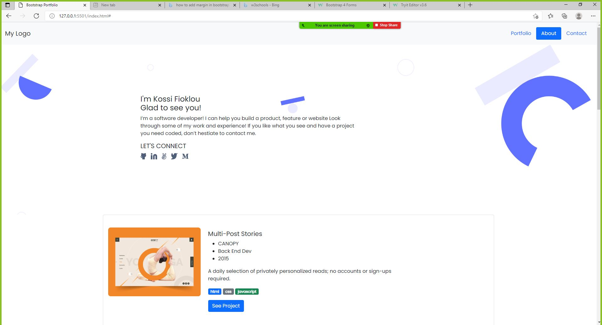

# Busi-Kossi-Bootstrap

> This project is to create a similar portfolio web page template of the figma template one using bootstrap. 

Using  the bootsrap nav bar, scrollspy, buttons and bootstrap form compenent. 

## Built With

- Html
- Css
- Bootstrap

## Getting Started

To get a local copy up and running follow these simple example steps.

- You can clone this repo by typing git clone `https://github.com/Kossi-stack/Mobile_Version_Skeleton.git` on your terminal
- Type cd `Mobile_Version_Skeleton` to access the project on the terminal

## Authors

👤 **Busiwa**
- GitHub: (https://github.com/Busiwa24)
- Twitter: (https://twitter.com/busiwaliuma)
- LinkedIn: (https://www.linkedin.com/in/busiwa-liuma-28385b80/

👤 **Kossi-Stack**

- GitHub: [@githubhandle](https://github.com/Kossi-stack/Mobile_Version_Skeleton)
- LinkedIn: [LinkedIn](https://www.linkedin.com/in/kossifioklou2406/)

## 🤝 Contributing

Contributions, issues, and feature requests are welcome!

Feel free to check the [issues page](https://github.com/Kossi-stack/Mobile_Version_Skeleton/issues).

## Show your support

Give a ⭐️ if you like this project!

